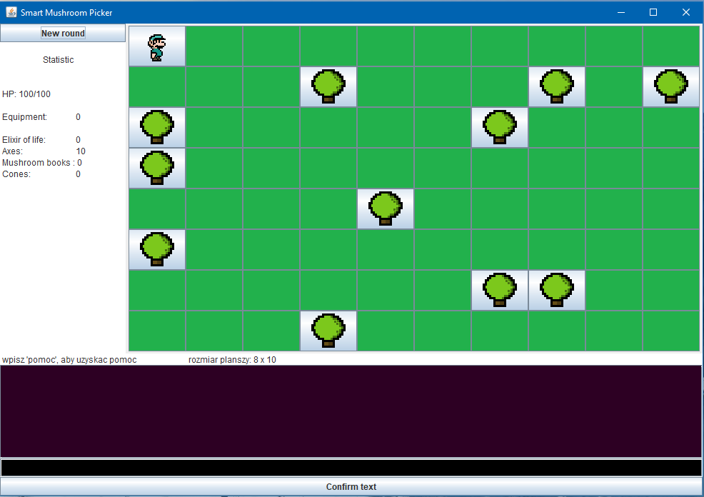
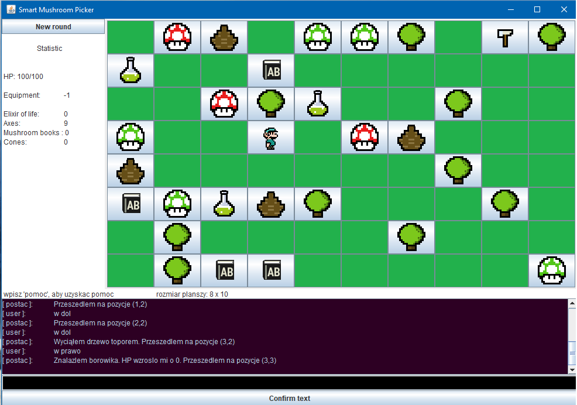
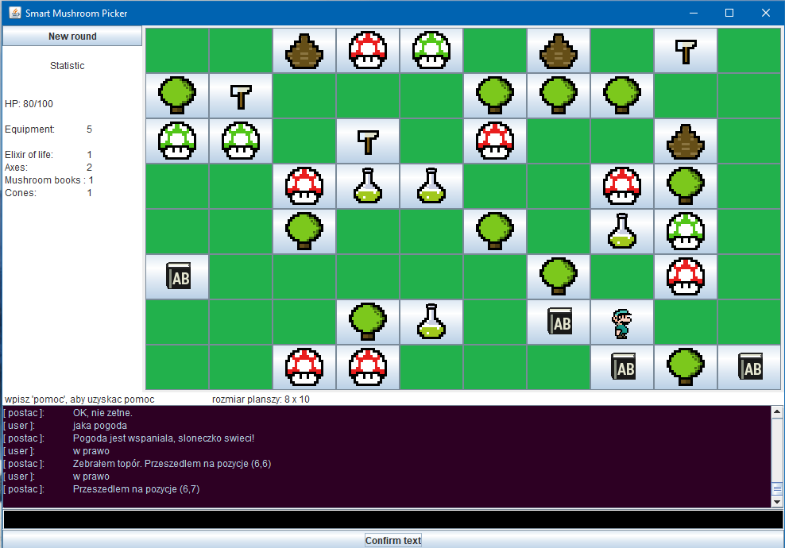

# HCI-Mushroom-Picker
Smart Mushroom Picker based on text commands. Created at the University as the project within Human-Computer Interaction classes in 2014. The purpose of this project was to create simple text interaction understanded by computer with graphics result for human.

## Project assumptions:

### Control
- character control by keyboard commands (natural language)
- recognizing keywords by means of a database (movement of characters, activities, conversation)

### World
- the turn system
- a board with dimensions of n ^ m
- in the world there are individual objects:
	- neutral blocks that prevent entering a given field - trees
	- interaction blocks that you can pick up and keep in your inventory (mushrooms, life elixirs, axes, pinecones, mushroom books)
- objects random generated

### Character
- HP life
- moving one space: right, left, up, down
- performing specified tasks
- equipment that allows you to store items
- conversation with the user

### Commands
- general help
- checking keywords
- character responses
- character suggestions in case of a blank message

### Interface
- command console
- a pop-up menu (new round, statistics)
- chart with traveled fields (visualization)
- equipment

### Screenshots
Screenshots examples. To see keeyword database and rules of using go to [documentation.pdf](resources/documentation.pdf).

  
